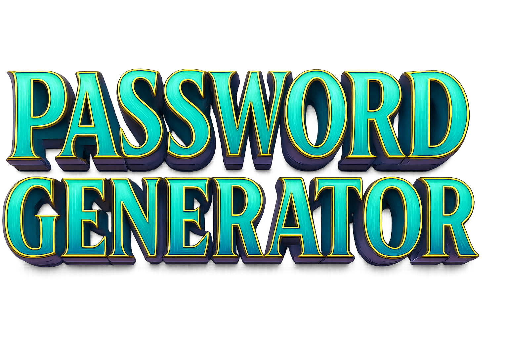

# 🔐 Password Generator

A simple web app that generates strong, random passwords.  
Built with **HTML**, **CSS** and **JavaScript**.

## 🚀 Live Demo
[View Live Demo](https://shaimoom251283.github.io/Password_Generator/)

## ✨ Features
- Generate strong random passwords
- Custom password length
- Include uppercase, lowercase, numbers and symbols
- Copy password to clipboard

## 🛠️ Technologies Used
- HTML
- CSS
- JavaScript

## 📦 How to Use
1. Open the app in a browser.
2. Enter desired password length.
3. Click **Generate**.
4. Click **Copy Password** to copy it to clipboard.

## 📄 License
This project is open-source and available under the [MIT License](LICENSE).
